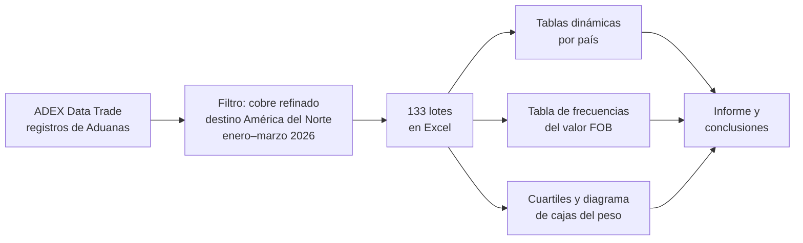
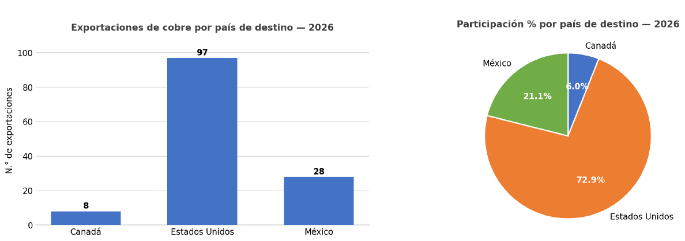
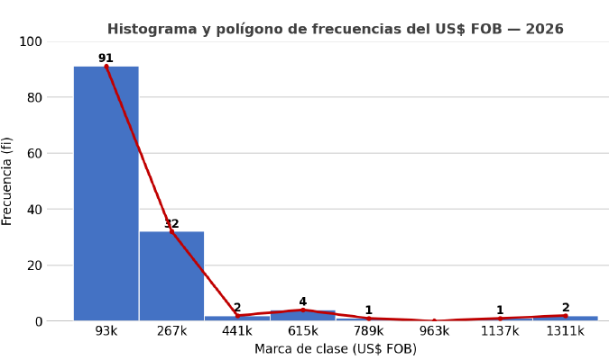
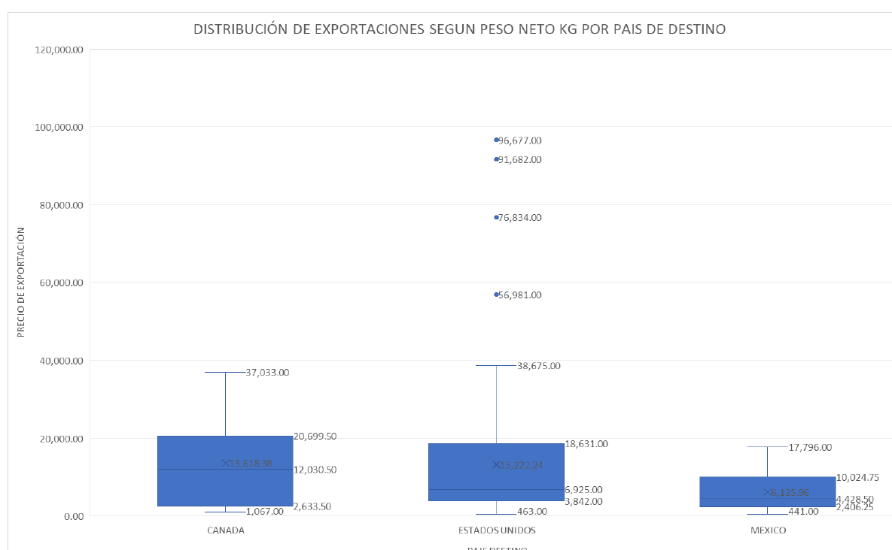

# Análisis de exportaciones de cobre: Perú → América del Norte (Q1 2026)

Trabajo final del curso **Estadística Aplicada I** (UPC). Analiza los 133 lotes de cobre refinado (partida arancelaria 7407100000) que Perú exportó a Estados Unidos, México y Canadá entre enero y marzo de 2026. Responde tres preguntas:

1. ¿A qué país se envía más?
2. ¿De cuánto dinero suele ser cada envío?
3. ¿Qué tan variable es el tamaño de los envíos según el destino?

El informe completo está en [`dashboard-cobre.pdf`](dashboard-cobre.pdf).

## Proceso

## 1. ¿A dónde va el cobre?

| Destino | Lotes | % |
|---|---|---|
| Estados Unidos | 97 | 72.9 % |
| México | 28 | 21.1 % |
| Canadá | 8 | 6.0 % |
| **Total** | **133** | **100 %** |

Casi 3 de cada 4 envíos van a Estados Unidos. Esa dependencia de un solo mercado hace que las exportaciones sean sensibles a cualquier cambio de aranceles o de demanda allá. Todos los envíos salieron de Lima.

## 2. ¿Cuánto vale cada envío?

| Valor FOB (US$) | Lotes | % | Acumulado |
|---|---|---|---|
| 6,122 – 180,183 | 91 | 68 % | 91 |
| 180,183 – 354,244 | 32 | 24 % | 123 |
| 354,244 – 528,305 | 2 | 2 % | 125 |
| 528,305 – 702,366 | 4 | 3 % | 129 |
| 702,366 – 1,398,609 | 4 | 3 % | 133 |

Los intervalos se calcularon con la regla de Sturges (k = 8). En la tabla, los últimos se agrupan en una sola fila.

La mayoría de los envíos son de valor moderado: el 92.5 % vale menos de US$ 354 mil. Unos pocos lotes grandes, 3 de ellos por encima del millón de dólares, estiran la distribución hacia la derecha y suben el promedio. Por eso, para describir un envío "típico" sirve más la mediana que el promedio.

## 3. ¿Qué tan parecidos son los envíos por país?

*El eje vertical muestra el peso neto en kg (en el gráfico original quedó rotulado como "precio de exportación").*

| Destino | Q1 (kg) | Q3 (kg) | Rango intercuartílico (kg) |
|---|---|---|---|
| Canadá | 2,633.5 | 20,699.5 | 18,066 |
| Estados Unidos | 3,842 | 18,631 | 14,789 |
| México | 2,406.25 | 10,024.75 | 7,618.5 |

- **Canadá** tiene los envíos más dispares en peso, aunque son solo 8 lotes.
- **México** es el destino más regular.
- **Estados Unidos** es el único con valores atípicos: 4 lotes de entre 57 y 97 toneladas, muy por encima del resto.

## Conclusiones

- Estados Unidos concentra el 72.9 % de los envíos de cobre: hay una fuerte dependencia de un solo mercado.
- El valor de los envíos es muy asimétrico: casi todos son moderados y pocos lotes grandes generan la cola derecha.
- Canadá es el destino con más variación en el peso de sus envíos y México el más consistente.

## Herramientas

Excel (tablas dinámicas, tabla de frecuencias, cuartiles y diagrama de cajas).

## Fuente

ADEX Data Trade (2026), con datos de Aduanas del Perú. Elaboración propia.
